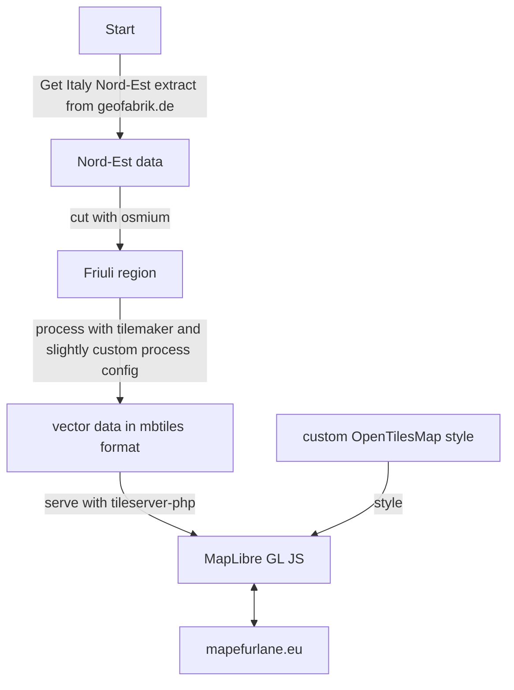

# Une mape libare dute par furlan - An open map in Friulian language

* pe documentazion par furlan cjale [par culì](docs/informazions.md)

## What is it

A project for a dedicated [OpenStreetMap](https://www.openstreetmap.org) rendering in [Friulian](https://en.wikipedia.org/wiki/Friulian_language), a minority language from north-east of Italy.

## Why

The goal is to have the first digital map ever in this minority language. The goal is to cover [Friuli region](https://en.wikipedia.org/wiki/Friuli) and the surrounding area.

## How

This rendering uses two tags:
* name:fur to represent the name of the feature in the official Friulian version
* loc_name:fur (optional) to represent the name of the feature in the local Friulian version (if different from the official one)

Local names are rendered on the map with the second one in a smaller font, if it exists.

See also the [documentation](https://wiki.openstreetmap.org/wiki/Key:name:fur) on the OpenStreetMap wiki.

## Updates

The goal is to have regular updates Data updates are fully automated and they are triggered by a change in the [MAPDATE file](MAPDATE.txt). At merge, data will be generated and published.

## Technical stack

The whole generation process is automated through a GitHub Workflow available in this repository running daily. The steps are described below.
1. getting extracts from geofabrik.de
2. cutting it with osmium
3. generating vector tiles with tilemaker
4. publishing vector tiles
5. publishing static files

### Visualization

Frontend is [MapLibre GL JS](https://maplibre.org/maplibre-gl-js-docs) with Nominatim as geocoder to offer a localized search engine.

The style is available [here](friul.json) and it's based on [OSM Liberty](https://maputnik.github.io/osm-liberty/) with some customizations:
* localized names
* mountain peaks
* airports

## Related projects

[Americana](https://zelonewolf.github.io/openstreetmap-americana/#map=8.65/46.1367/13.2534&language=fur) is a general purpose rendering also based on vector tiles that can shown localized labels, including in Friulian.
It offers a better visualization and level of polish; compared to Mape Furlane, it lacks a few things:
* local Friulian variants
* search is not localized [(issue)](https://github.com/ZeLonewolf/openstreetmap-americana/issues/862)
* road names not localized [(issue)](https://github.com/ZeLonewolf/openstreetmap-americana/issues/618)

## Contributing

Any issue report or contribution is welcome!
